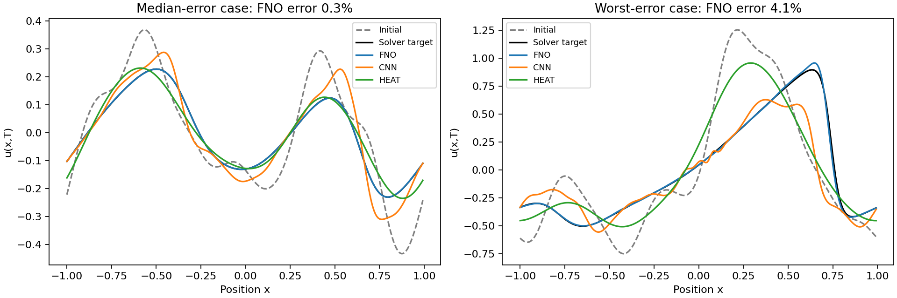
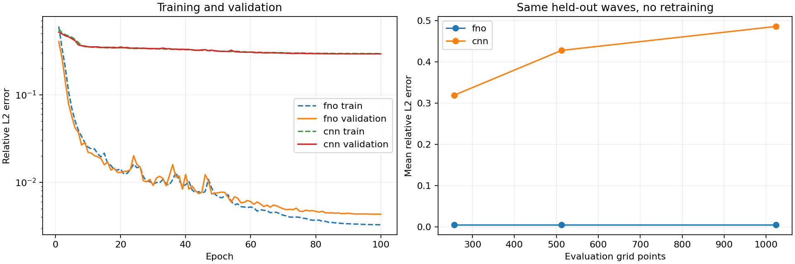

# Measured experiment results

CPU run; 150 untouched test cases; seed 42.

| Model | Mean relative L2 | Median | 95th percentile | Worst |
|---|---:|---:|---:|---:|
| fno | 0.47% | 0.26% | 1.52% | 4.10% |
| cnn | 28.06% | 24.66% | 54.57% | 75.44% |
| identity | 63.94% | 56.35% | 109.42% | 150.78% |
| heat | 40.81% | 38.92% | 63.14% | 73.89% |

## Resolution transfer

| Grid | Cases | FNO error | CNN error | FNO speedup vs reference solver |
|---|---:|---:|---:|---:|
| 256 | 16 | 0.49% | 31.90% | 9.1x |
| 512 | 16 | 0.49% | 42.78% | 17.8x |
| 1024 | 16 | 0.49% | 48.60% | 40.6x |

## Solver accuracy versus runtime

Same held-out waves as grid transfer, evaluated at the training resolution.
Solver predictions are Fourier-interpolated to that resolution; timing includes interpolation.

| Solver grid | Mean relative L2 | Batch time (seconds) |
|---|---:|---:|
| 32 | 1.0990% | 0.00273 |
| 64 | 0.0306% | 0.00648 |
| 128 | 0.0011% | 0.01764 |
| 256 | 0.0002% | 0.05758 |

Neural timings for the same waves are in resolution_transfer in metrics.json.
Use this curve to compare accuracy and cost; a coarse numerical solve may be preferable.

Timing uses the same waves on the same CPU. Neural timing includes NumPy/tensor conversion,
uses five repetitions after warm-up, and reports the median. Solver timing is one
batched run on the reported finer reference grid, including downsampling.
Speedup is relative to this reference solver; it is not a universal or accuracy-matched solver benchmark.
Training and data generation costs are separate in metrics.json.

Physics checks are diagnostics, not constraints imposed on the model. See metrics.json
for mean drift and energy increases, full configuration, and convergence errors.

